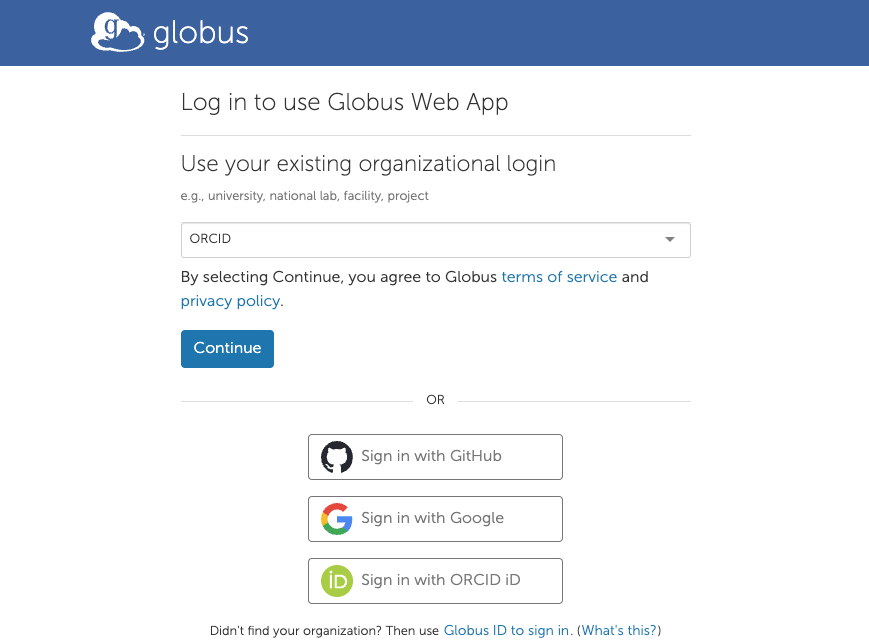
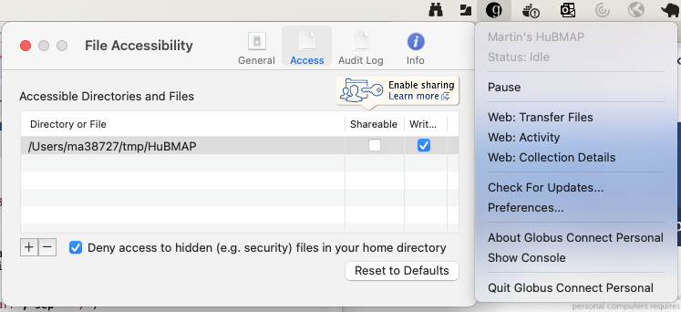

```{r, include = FALSE}
knitr::opts_chunk$set(
  collapse = TRUE
)
```

[](https://lifecycle.r-lib.org/articles/stages.html#experimental)

# Introduction & installation

This package is EXPERIMENTAL. It enables access to Globus collection
management (including 'personal' collections on your own computer),
including file and directory transfer.  The functions implemented in
this package are primarily from the Globus 'Transfer' API, documented
at <https://docs.globus.org/api/transfer/>.  Many other capabilities
of Globus are not implemented.

Install the package if necessary

```{r install_github, eval = FALSE}
if (!requireNamespace("remotes", quiety = TRUE))
    install.packages("remotes", repos = "https://CRAN.R-project.org")
remotes::install_github("mtmorgan/rglobus")
```

Attach the package to your *R* session

```{r library, message = FALSE}
library(rglobus)
```

# Discovering and navigating collections

The functions discussed here are based on the APIs described in
[Endpoints and Collections][] and [Endpoint and Collection Search][].

[Endpoints and Collections]: https://docs.globus.org/api/transfer/endpoints_and_collections/
[Endpoint and Collection Search]: https://docs.globus.org/api/transfer/endpoint_and_collection_search/

Globus data sets are organized into collections. Start by discovering
collections that contain the words "HuBMAP" and "Public", in any
order.

```{r}
hubmap_collections <- collections("HuBMAP Public")
hubmap_collections
```

## Authentication

The first time `collections()` is invoked, Globus requires that you
authenticate. A web page appears, where one can choose authentication
via generic identifiers like ORCID or Google, or through an
institution that you belong to. Follow the browser prompt(s) and
return to *R* when done.

[](#authentication){style="display:block; margin-left:auto; margin-right:auto; width:80%"}

## Collection content

Each collection is presented as directories and files. Focus on the
'HuBMAP Public' collection.

```{r}
hubmap <-
    hubmap_collections |>
    dplyr::filter(display_name == "HuBMAP Public")
```

List the content of the collection.

```{r}
globus_ls(hubmap)
```

There are `r NROW(globus_ls(hubmap))` records, each corresponding to a
HuBMAP dataset. Information about each dataset, e.g., the dataset with
name `0008a49ac06f4afd886be81491a5a926` is available from the
[HuBMAP][] data portal, or using the [HuBMAPR][] package. (Usually,
one would 'discover' the dataset name using the data portal or
[HuBMAPR][], and then use `rglobus` to further explore the content).

List the content of a dataset of interest by adding a path to
`globus_ls()`, e.g.,

```{r}
path <- "0008a49ac06f4afd886be81491a5a926"
globus_ls(hubmap, path)
```

The dataset consists of files and directories; further explore the
content of individual directories by constructing the appropriate path.

```{r}
path <- paste(path, "anndata-zarr", sep = "/")
globus_ls(hubmap, path)

path <- paste(path, "reg1_stitched_expressions-anndata.zarr", sep = "/")
hubmap |> globus_ls(path)
```

Note in the last example that the functions in `rglobus` are designed
to support 'piping'.

[HuBMAP]: https://portal.hubmapconsortium.org/search?q=0008a49ac06f4afd886be81491a5a926&processing[0]=processed&entity_type[0]=Dataset
[HuBMAPR]: https://christinehou11.github.io/HuBMAPR/

## Local collections

Globus provides software to allow your laptop to appear as a
collection. Follow the [Globus Connect Personal][] installation
instructions for your operating system, and launch the
application. Then identify a location on your local disk to act as a
collection.

On macOS, I created a directory `~/tmp/HuBMAP`, and then configured
Globus Connect Personal to share that location. I did this by
launching the application (it appears as an icon in the menu bar) then
selecting 'Preferences' and using the '-' and '+' buttons to select
the path to my local collection.

[](#local-collections){style="display:block; margin-left:auto; margin-right:auto; width:80%"}

Collections owned by you appear in `collections()`, but the
convenience function `my_collections()` provides another way to access
these.

```{r}
my_collections <- my_collections()
my_collections
```

One aspect of the collection is that the path from the root (starting
with `/`) or relative to the user home directory needs to be
specified.

```{r}
globus_ls(my_collections, "/Users/ma38727/tmp")

path <- "tmp"
globus_ls(my_collections, path)

## nothing here yet...
path <- "tmp/HuBMAP"
globus_ls(my_collections, path)
```

The local connection is under our ownership, so it is possible to,
e.g., create a directory; `mkdir()` returns the updated directory
listing of the enclosing folder.

```{r}
mkdir(my_collections, "tmp/HuBMAP/test")
```

Of course we could have used our operating system to create the
directory in the path of the local collection.

[Globus Connect Personal]: https://www.globus.org/globus-connect-personal

# Directory and file transfer

Directory and file transfer are described in the [Task Submission][] API.

[Task Submission]: https://docs.globus.org/api/transfer/task_submit/

Start this section by ensuring we have the HuBMAP and our own collections

```{r}
hubmap <-
    hubmap_collections |>
    dplyr::filter(display_name == "HuBMAP Public")
my_collections <- my_collections()
```

We illustrate directory and file transfer on a specific HuBMAP
dataset. Here is the dataset and directory content

```{r}
hubmap_dataset <- "d1dcab2df80590d8cd8770948abaf976"
globus_ls(hubmap, hubmap_dataset)
```

## File transfer

Use `copy()` to transfer files or directories between collections. We
start with the `metadata.json` file, and transfer it to the 'test'
directory in our local collection. Define the source and destination
paths in the two collections.

```{r}
source_path <-
    paste(hubmap_dataset, "metadata.json", sep = "/")
destination_path <-
    paste("tmp/HuBMAP/test", basename(source_path), sep = "/")
```

Globus anticipates that large data transfers may be involved, so the
`copy()` operation actually submits a task that runs
asynchronously. Globus has confidence in the robustness of their file
transfer, so adopt a 'fire and forget' philosophy -- the task will
eventually succeed or fail, perhaps overcoming intermittent network or
other issues.

The `...` optional arguments to `copy()` are the same as the arguments
for the lower-level `transfer()` function. By default, transfer tasks
send email on completion, but we will check on task progress and
respond appropriately. Each task can be labeled, the default label is
provided by `transfer_label()`.

```{r}
task <- copy(
    hubmap, my_collections,        # collections
    source_path, destination_path, # paths
    notify_on_succeeded = FALSE
)
task |>
    dplyr::glimpse()
```

We anticipate that `code` is "Accepted", indicating that the task is
sufficiently well-formatted to be added to the task queue.

## Task management

Use `task_status()` to check on status.

```{r}
task_status(task)
```

The `status` column changes from `ACTIVE` to `SUCCEEDED` for
successful tasks. An active task proceeding normally has `nice_status`
either `Queued` or `OK`. An active task may be encountering errors,
e.g., because the local connection is offline (`CONNECTION_FAILED`) or
paused (`GC_PAUSED`) or that the source or destination file exists but
the user does not have permission to read or write it
(`PERMISSION_DENIED`). Perhaps unintuitively, Globus views these
errors as transient (e.g., because the local collection may come back
online) and so continues to try to complete the task. Active tasks
that persist in an error state will eventually fail.

Failed tasks have status `FAILED`.

Let's write a simple loop to check on status, allowing the task to run
for up to 60 seconds.

```{r}
now <- Sys.time()
repeat {
    status <- task_status(task)$status
    complete <- status %in% c("SUCCEEDED", "FAILED")
    if (complete || Sys.time() - now > 60)
        break
    Sys.sleep(5)
}
```

If the task was successful, we should see the file in our local
collection.

```{r}
status
globus_ls(my_collections, "tmp/HuBMAP/test")
```

If the task has failed or is still active for `nice_status` reasons
that are not likely to resolve, the task can be canceled. Actually,
canceling a completed task generates a useful message without error.

```{r}
task_cancel(task)
```

## Directory transfer

Directory transfer is similar. Here we transfer the entire HuBMAP
dataset to our local collection.

Specify the source path as the HuBMAP dataset, and the destination
path as the dataset id in our local collection.

```{r}
source_path <- hubmap_dataset
destination_path <- paste("tmp/HuBMAP", hubmap_dataset, sep = "/")
```

Submit the task as before, but add `recursive = TRUE` since this is a
directory. As the task may take quite a while to complete, we will not
change the default `notify_on_succeeded` option. Check on its initial
status.

```{r}
task <- copy(
    hubmap, my_collections,        # collections
    source_path, destination_path, # paths
    recursive = TRUE
)
task_status(task)
```

The task is added to a queue, and eventually the entire content of the
HuBMAP dataset is transferred.

One can gain additional insight into the progress of the task by
asking for `all_fields` of the task status. Relevant fields are the
number of bytes transferred and the effective transfer rate. We use a
helper function to format these values in a more intelligibly.

```{r, eval = FALSE}
bytes_to_units <-
    function(x)
{
    ## use R's 'object_size' S3 class to pretty-print bytes as MB, etc
    x |>
        structure(class = "object_size") |>
        format(units = "auto")
}

task_status(task, all_fields = TRUE) |>
    dplyr::select(
        status, nice_status,
        bytes_transferred,
        effective_bytes_per_second
    ) |>
    dplyr::mutate(
        bytes_transferred = bytes_to_units(bytes_transferred),
        effective_bytes_per_second =
            bytes_to_units(effective_bytes_per_second)
    )
##   status nice_status bytes_transferred effective_bytes_per_second
##   <chr>  <chr>       <chr>             <chr>
## 1 ACTIVE OK          227.8 Mb          486.9 Kb
```

The transfer can take some time, so in the interest of brevity we
cancel the task.

```{r}
task_cancel(task)
```

Neglecting to set `recursive = TRUE` results in a `nice_status`
`IS_A_DIRECTORY`. Globus nonetheless continues to try the file
transfer, but we would recognize this as 'user error' and would cancel
and resubmit the task.

```{r, eval = FALSE}
task <- copy(
    hubmap, my_collections, # collections
    source_path,
    destination_path
)
## ...
task_status(task)
## # A tibble: 1 × 5
##   task_id                              type     status nice_status    label
##   <chr>                                <chr>    <chr>  <chr>          <chr>
## 1 36bee1e6-5a5b-11ef-be9a-83cd94efb466 TRANSFER ACTIVE IS_A_DIRECTORY 2024-08-1…

## Oops, forgot the `recursive = TRUE` option
task_cancel(task)
task <- copy(
    hubmap, my_collections, # collections
    source_path,
    destination_path,
    recursive = TRUE
)
```

## Complicated transfer tasks

Globus supports more complicated tasks, for instance submitting
multiple transfer tasks at once, or synchronizing two locations. These
will be developed in subsequent iterations of the package.

# Session information

This vignette was compiled using the following software versions

```{r session_info}
sessionInfo()
```
